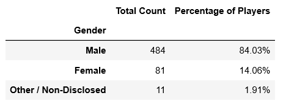

In this project, Pandas was used to analyze data from the MMORPG computer game Heroes of Pymoli.

## Python Code

```python
# Dependencies
import pandas as pd
import numpy as np

# File to load
file_to_load = "Resources/purchase_data.csv"

# Read the purchase data file and store into dataframe
purchase_data_df = pd.read_csv(file_to_load, encoding="utf-8")
```


```python
### Display the total number of players ###

# Count number of unique players
players_count = len(purchase_data_df["SN"].unique())

# Place count of players into a datafrrame
players_count_df = pd.DataFrame({"Total Players": [players_count]})

# Display the dataframe
players_count_df
```


```python
#### Purchasing Analysis (Total) ###

# Count the number of unique items
unique_items_count = len(purchase_data_df["Item ID"].unique())

# Calculate average price
average_price = purchase_data_df["Price"].mean()

# Find the total number of purchases
total_purchases = purchase_data_df["Purchase ID"].count()

# Find the total revenue
total_revenue = purchase_data_df["Price"].sum()

# Create a summary data frame to hold the results with cleaner formatting
purchasing_analysis_total_df = pd.DataFrame({"Number of Unique Items": [unique_items_count],
                            "Average Price": [average_price],
                            "Number of Purchases": [total_purchases],
                            "Total Revenue": [total_revenue]})

# Change formatting
purchasing_analysis_total_df["Average Price"] = purchasing_analysis_total_df["Average Price"].map("${:,.2f}".format)
purchasing_analysis_total_df["Total Revenue"] = purchasing_analysis_total_df["Total Revenue"].map("${:,.2f}".format)

# Display the summary data frame
purchasing_analysis_total_df
```


```python
### Gender Demographics ###

# Get male demographics
male_df = purchase_data_df.loc[purchase_data_df["Gender"] == "Male"]
male_count = male_df["SN"].nunique()
male_percentage = male_count/players_count * 100

# Get female demographics
female_df = purchase_data_df.loc[purchase_data_df["Gender"] == "Female"]
female_count = female_df["SN"].nunique()
female_percentage = female_count/players_count * 100

# Get other/nondisclosed demographics
other_df = purchase_data_df.loc[purchase_data_df["Gender"] == "Other / Non-Disclosed"]
other_count = other_df["SN"].nunique()
other_percentage = other_count/players_count * 100

# Create gender demographics dataframe
gender_demographics_df = pd.DataFrame({"Gender": ["Male", "Female", "Other / Non-Disclosed"],
                                        "Total Count": [male_count, female_count, other_count],
                                       "Percentage of Players":[male_percentage, female_percentage, other_percentage] })

# Change formatting
gender_demographics_df["Percentage of Players"] = gender_demographics_df["Percentage of Players"].map("{:.2f}%".format)

# Set index to gender
gender_demographics_df = gender_demographics_df.set_index("Gender")

# Display the dataframe
gender_demographics_df
```



```python
### Purchasing Analysis (Gender) ###

# Run basic calculations to obtain purchase count, avg. purchase price, avg. purchase total per person etc. by gender
male_purchase_count = male_df["Purchase ID"].count()
male_total_purchase_value = male_df["Price"].sum()
male_avg_purchase_price = male_total_purchase_value/male_purchase_count
male_avg_total_purchase_per_person = male_total_purchase_value/male_count

female_purchase_count = female_df["Purchase ID"].count()
female_total_purchase_value = female_df["Price"].sum()
female_avg_purchase_price = female_total_purchase_value/female_purchase_count
female_avg_total_purchase_per_person = female_total_purchase_value/female_count

other_purchase_count = other_df["Purchase ID"].count()
other_total_purchase_value = other_df["Price"].sum()
other_avg_purchase_price = other_total_purchase_value/other_purchase_count
other_avg_total_purchase_per_person = other_total_purchase_value/other_count

# Create a summary data frame to hold the results
purchasing_analysis_gender_df = pd.DataFrame({"Gender":["Female", "Male", "Other / Non-Disclosed"],
                    "Purchase Count":[female_purchase_count, male_purchase_count, other_purchase_count],
                    "Average Purchase Price":[female_avg_purchase_price, male_avg_purchase_price, other_avg_purchase_price],
                    "Total Purchase Value":[female_total_purchase_value, male_total_purchase_value, other_total_purchase_value],
                    "Avg Total Purchase per Person":[female_avg_total_purchase_per_person, male_avg_total_purchase_per_person, other_avg_total_purchase_per_person]
                     })

# Give the displayed data cleaner formatting
purchasing_analysis_gender_df["Average Purchase Price"] = purchasing_analysis_gender_df["Average Purchase Price"].map("${:,.2f}".format)
purchasing_analysis_gender_df["Total Purchase Value"] = purchasing_analysis_gender_df["Total Purchase Value"].map("${:,.2f}".format)
purchasing_analysis_gender_df["Avg Total Purchase per Person"] = purchasing_analysis_gender_df["Avg Total Purchase per Person"].map("${:,.2f}".format)

# Set index to gender
purchasing_analysis_gender_df = purchasing_analysis_gender_df.set_index("Gender")

# Display the summary data frame
purchasing_analysis_gender_df
```


```python
### Age Demographics ###

# Establish bins for ages
age_bins = [0, 9, 14, 19, 24, 29, 34, 39, 100]
age_labels = ["<10","10-14","15-19","20-24","25-29","30-34","35-39","40+"]

# Categorize the existing players using the age bins
purchase_data_df["Age Group"] = pd.cut(purchase_data_df["Age"], age_bins, labels=age_labels)

# Calculate the numbers and percentages by age group
age_group = purchase_data_df.groupby("Age Group")

count_by_age = age_group["SN"].nunique()
percentage_by_age = count_by_age/players_count * 100

# Create a summary data frame to hold the results
age_demographics_df = pd.DataFrame({"Total Count": count_by_age,
                                    "Percentage of Players": percentage_by_age})

# Round the percentage column to two decimal points
age_demographics_df["Percentage of Players"] = age_demographics_df["Percentage of Players"].map("{:.2f}%".format)

# Display the age demographics dataframe
age_demographics_df
```


```python
### Purchasing Analysis (Age) ###

# Run basic calculations to obtain purchase count, avg. purchase price, avg. purchase total per person etc. using purchase data dataframe grouped and binned by age
purchase_count_by_age = age_group["Purchase ID"].count()
total_purchase_value_by_age = age_group["Price"].sum()
avg_purchase_price_by_age = total_purchase_value_by_age/purchase_count_by_age
avg_total_purchase_per_person_by_age = total_purchase_value_by_age/count_by_age

# Create a summary data frame to hold the results
purchasing_analysis_age_df = pd.DataFrame({"Purchase Count": purchase_count_by_age,
                                           "Average Purchase Price": avg_purchase_price_by_age,
                                           "Total Purchase Value": total_purchase_value_by_age,
                                           "Avg Total Purchase per Person": avg_total_purchase_per_person_by_age})

# Give the displayed data cleaner formatting
purchasing_analysis_age_df["Average Purchase Price"] = purchasing_analysis_age_df["Average Purchase Price"].map("${:,.2f}".format)
purchasing_analysis_age_df["Total Purchase Value"] = purchasing_analysis_age_df["Total Purchase Value"].map("${:,.2f}".format)
purchasing_analysis_age_df["Avg Total Purchase per Person"] = purchasing_analysis_age_df["Avg Total Purchase per Person"].map("${:,.2f}".format)

# Display the summary data frame
purchasing_analysis_age_df
```


```python
### Top Spenders ###

# Group purchase data by player SN
sn_group = purchase_data_df.groupby("SN")

# Find the purchase count by player SN
purchase_count_by_sn = sn_group["Purchase ID"].count()

# Find the total purchase value by player SN
total_purchase_value_by_sn = sn_group["Price"].sum()

# Find the average purchase price by player SN
avg_purchase_price_by_sn = total_purchase_value_by_sn/purchase_count_by_sn

# Create a summary data frame to hold the results
summary_spenders_df = pd.DataFrame({"Purchase Count": purchase_count_by_sn,
                                "Average Purchase Price": avg_purchase_price_by_sn,
                                "Total Purchase Value": total_purchase_value_by_sn})

# Sort the total purchase value column in descending order
top_spenders_df = summary_spenders_df.sort_values("Total Purchase Value", ascending=False)

# Give the displayed data cleaner formatting
top_spenders_df["Average Purchase Price"] = top_spenders_df["Average Purchase Price"].map("${:,.2f}".format)
top_spenders_df["Total Purchase Value"] = top_spenders_df["Total Purchase Value"].map("${:,.2f}".format)

# Display a preview of the summary data frame
top_spenders_df.head()
```


```python
### Most Popular Items ###

# Retrieve the Item ID, Item Name, and Item Price columns
items_df = purchase_data_df.loc[:,["Item ID", "Item Name", "Price"]]

# Group by Item ID and Item Name.
items_group = items_df.groupby(["Item ID","Item Name"])

# Perform calculations to obtain purchase count, item price, and total purchase value
purchase_count_by_item = items_group["Item ID"].count()
total_purchase_value_by_item = items_group["Price"].sum()
item_price = items_group["Price"].mean()

# Create a summary data frame to hold the results
summary_items_df = pd.DataFrame({"Purchase Count": purchase_count_by_item,
                                "Item Price": item_price,
                                "Total Purchase Value": total_purchase_value_by_item})

# Sort the purchase count column in descending order
popular_items_df = summary_items_df.sort_values("Purchase Count", ascending=False)

# Give the displayed data cleaner formatting
popular_items_df["Item Price"] = popular_items_df["Item Price"].map("${:,.2f}".format)
popular_items_df["Total Purchase Value"] = popular_items_df["Total Purchase Value"].map("${:,.2f}".format)

# Display a preview of the summary data frame
popular_items_df.head()
```


```python
### Most Profitable Items ###

# Sort the above table by total purchase value in descending order
profitable_items_df = summary_items_df.sort_values("Total Purchase Value", ascending=False)

# Give the displayed data cleaner formatting
profitable_items_df["Item Price"] = profitable_items_df["Item Price"].map("${:,.2f}".format)
profitable_items_df["Total Purchase Value"] = profitable_items_df["Total Purchase Value"].map("${:,.2f}".format)

# Display a preview of the data frame
profitable_items_df.head()
```


## Data Analysis

The majority of players are young adults who fall in the age group of 20-24 (44.79%).  A significant number of players also fall in the age group of 15-19 (18.58%) 
and the age group of 25-29 (13.37%).

The majority of purchases are from players that fall in the age group of 20-24 (365 purchases).  This age group also has the highest total purchase value 
($1,114.06).  However, the age group of 35-39 has the average highest total purchase per person ($4.76), followed by the age group of < 10 ($4.54), and the 
age group of 20-24 ($4.32).

The male gender group has the highest total purchase value ($1,967.64), but the female gender group and other/nondisclosed gender group have higher average 
purchase price (female gender group: $4.47, other/nondislosed gender group: $4.56) than the male gender group ($4.07).  The female gender group and 
other/nondisclosed gender group also have higher average total purchase per person than the male gender group (female gender group: $3.20, other/nondisclosed 
gender group: $3.35, male gender group: $3.02).